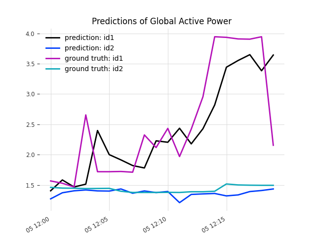

Multivariate Time Series Pipeline
==============================

A demonstration of building an interpretable multivariate time series feature engineering pipeline for forecasting.

## Quick Start
1. Install the required Python packages. Installation in a virtual environment is recommended, see [virtualenvwrapper](https://virtualenvwrapper.readthedocs.io/en/latest/) for an example.
```
pip install -r requirements.txt
```
2. Set the Python path to `multivariate_time_series_pipeline`.
```
export PYTHONPATH=$PYTHONPATH:{your_local_path/multivariate_time_series_pipeline}
```  
where by **your_local_path** is the path containing the `multivariate_time_series_pipeline` repository.

3. Execute the Python scripts at the `multivariate_time_series_pipeline` path with the following 
scripts in sequence:  
   - `src/data/make_dataset.py`: Download the raw data and prepare a mock data for demo.
   - `src/features/make_features.py`: Perform time series feature engineering.
   - `src/models/train_and_predict.py`: Train a simple linear regression model for time series predictions using [darts](https://github.com/unit8co/darts) package.
4. A successful time series prediction expects to replicate a chart as shown below 
 

## Overview
This project is inspired by the need of:  
  * Build a time series feature engineering pipeline using the [Sklearn pipeline](https://scikit-learn.org/stable/modules/generated/sklearn.pipeline.Pipeline.html) such that the pipeline can be used repeatedly for different use cases with minimal customization.  
  * Get a clear idea of the types of transformations performed to obtain the features based on the feature names. Sklearn pipeline may also shuffle the column order of derived features upon the transformation and thus it is not straight forward to track the derived features based on the matrix values. The output feature names at pipeline's stages should illustrate the types of transformations performed and the users can then select the relevant intermediate features for further feature processings.  
  * Configure the desired features using a time series feature derivation library such as [tsfresh](https://tsfresh.readthedocs.io/en/latest/) during the intermediate stage of pipeline transformation. The time series derived features in particular focuses on the rolling based feature derivation.

### Key Ideas
This project leverages [mixin (a simple type of multiple inheritance)](https://www.ianlewis.org/en/mixins-and-python) and [factory method](https://realpython.com/factory-method-python/) to implement components used in the customized pipeline. The key components include the customized Python class objects in [custom_transformers.py](src/features/custom_transformers.py) and [tsfresh_transformers.py](src/features/tsfresh_transformers.py). The [make_features.py](src/features/make_features.py) file demonstrates the usage of these components to perform time series feature engineering.


